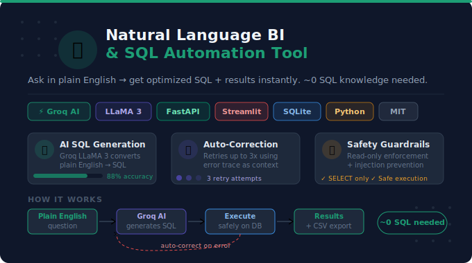
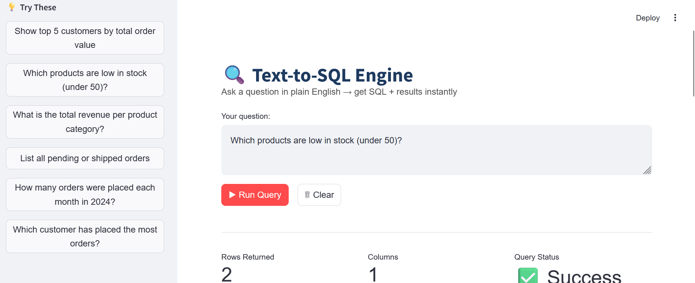

# 🧠 Natural Language Business Intelligence & SQL Automation Tool

> Describe what you need in plain English — get production-ready, optimized SQL back with query explanation, schema awareness, and execution preview. **~0 SQL knowledge needed by end users.**

[](https://python.org)
[](https://groq.com)
[](https://fastapi.tiangolo.com)
[](https://streamlit.io)
[](https://sqlite.org)
[](LICENSE)

---

## 📸 Preview





---

## 🎯 What It Does

This tool bridges the gap between **business analysts** and **raw databases** — no SQL expertise required. Type a question in plain English, and the system:

1. Understands your database schema automatically
2. Generates optimized SQL using **Groq AI (LLaMA 3)**
3. Executes the query safely (read-only, injection-safe)
4. Returns results + explanation in seconds
5. Auto-corrects any SQL errors using the error trace as context

---

## ✨ Features

- 🤖 **Groq AI (LLaMA 3)** — Ultra-fast, low-latency SQL generation from natural language
- 🔄 **Auto-Correction Loop** — Retries up to 3 times on SQL errors, re-prompting with error context
- 🗺️ **Dynamic Schema Injection** — Full schema passed into LLM prompt for accurate multi-table reasoning
- 🛡️ **Query Safety Guardrails** — Read-only enforcement and SQL injection prevention
- 📊 **Streamlit Dashboard** — Query history, schema viewer, sample questions, real-time results
- 📤 **One-Click Export** — Download results as CSV or JSON for reporting
- ⚡ **FastAPI Backend** — RESTful endpoints for `/query/`, `/schema/`, and `/health/`
- 🗄️ **SQLite Demo Database** — 4 normalized tables, 8 customers, 8 products, 10 orders

---

## 🗂️ Project Structure

```
nl-bi-sql-tool/
├── app/
│   ├── api/routes.py          ← FastAPI endpoints (/query, /schema, /health)
│   ├── core/config.py         ← Reads .env (Groq API key, DB URL)
│   ├── core/groq_service.py   ← Groq AI + auto-correct loop
│   ├── db/database.py         ← SQLAlchemy engine + schema extractor
│   ├── schemas/query.py       ← Pydantic request/response models
│   └── main.py                ← FastAPI app factory
├── seed_db.py                 ← Seeds demo e-commerce database
├── streamlit_app.py           ← Full interactive UI
├── .env.example               ← Copy → .env, add your Groq API key
├── requirements.txt
└── README.md
```

---

## 🚀 Quick Start

### 1. Clone the Repository

```bash
https://github.com/diveshkumar2233/Natural-Language-Business-Intelligence-SQL-Automation-Tool
cd nl-bi-sql-tool
```

### 2. Create a Virtual Environment

**Windows (PowerShell):**
```powershell
python -m venv venv
venv\Scripts\activate
```

**macOS / Linux:**
```bash
python -m venv venv
source venv/bin/activate
```

### 3. Install Dependencies

```bash
pip install -r requirements.txt
```

### 4. Configure Environment Variables

```bash
cp .env.example .env        # Windows: copy .env.example .env
```

Open `.env` and fill in:

```env
GROQ_API_KEY=gsk_...
DATABASE_URL=sqlite:///./sql_app.db
```

Get your free Groq API key at [console.groq.com](https://console.groq.com).

### 5. Seed the Demo Database

```bash
python seed_db.py
```

Creates `sql_app.db` with a realistic e-commerce dataset:

| Table | Records | Description |
|---|---|---|
| `customers` | 8 | Names, emails, cities across India |
| `products` | 8 | Electronics, Office, Furniture, Stationery |
| `orders` | 10 | Jan–May 2024, various statuses |
| `order_items` | 20+ | Line items linking orders ↔ products |

### 6. Start the FastAPI Backend

```bash
uvicorn app.main:app --reload
```

API live at `http://localhost:8000` — Swagger docs at `http://localhost:8000/docs`

### 7. Launch the Streamlit UI

```bash
streamlit run streamlit_app.py
```

Opens at `http://localhost:8501`

---

## 🔌 API Reference

### `POST /api/query/`
Convert a plain-English question to SQL and return results.

**Request:**
```json
{ "question": "Which customer has spent the most money overall?" }
```

**Response:**
```json
{
  "question": "Which customer has spent the most money overall?",
  "sql": "SELECT c.name, SUM(oi.quantity * oi.unit_price) AS total_spend FROM customers c JOIN orders o ON c.id = o.customer_id JOIN order_items oi ON o.id = oi.order_id GROUP BY c.id ORDER BY total_spend DESC LIMIT 1",
  "results": [{ "name": "Alice Johnson", "total_spend": 82500.0 }],
  "row_count": 1,
  "attempts": 1,
  "error": null
}
```

### `GET /api/schema/`
Returns all tables, columns, types, and foreign keys.

### `GET /api/health/`
Returns `{"status": "ok"}`.

---

## 💡 Sample Business Questions

| Question | SQL Concept |
|---|---|
| Show all customers from Mumbai | `WHERE` filter |
| What are the top 3 best-selling products by quantity? | `GROUP BY` + `ORDER BY` |
| List all delivered orders with their total value | Multi-table `JOIN` |
| Which customer has spent the most money? | Aggregation + `LIMIT` |
| How many orders were placed each month in 2024? | Date functions |
| Show products with stock below 50 | Range filter |
| What is the total revenue per product category? | `GROUP BY` category |
| List all pending or shipped orders | `IN` clause |

---

## 🔄 How the Auto-Correction Loop Works

```
Plain English Question
         │
         ▼
  Groq AI (LLaMA 3)
  generates SQL
  with full schema context
         │
         ▼
  Execute SQL safely
         ├── ✅ Success → Return results + row count
         └── ❌ Error ──→ Send SQL + error trace back to Groq
                                    │
                                    ▼
                             Groq fixes SQL
                             (attempt 2)
                                    │
                                    ▼
                             Execute again
                                    ├── ✅ Success → Return results
                                    └── ❌ Error ──→ Attempt 3
                                                      │
                                                      ▼
                                               Return error message
```

---

## 🛡️ Safety & Guardrails

- **Read-only enforcement** — Only `SELECT` statements are permitted; `INSERT`, `UPDATE`, `DELETE`, `DROP` are blocked
- **SQL injection prevention** — Queries run via parameterized SQLAlchemy execution
- **Error isolation** — Failed queries never affect database state
- **Attempt capping** — Maximum 3 LLM correction attempts to prevent infinite loops

---

## 📋 Resume Bullets (Data Analyst)

```
Natural Language Business Intelligence & SQL Automation Tool
Tech: Python | Groq AI (LLaMA 3) | FastAPI | Streamlit | SQLAlchemy | SQLite | Pandas

• Engineered a Text-to-SQL system using Groq AI (LLaMA 3) and SQLAlchemy that converts
  plain-English business questions into optimized SQL queries with near real-time response

• Built dynamic schema injection into LLM prompt context, enabling the model to reason
  across multi-table joins, aggregations, and time-series filters with high first-pass accuracy

• Developed FastAPI backend with query execution, result formatting, and natural language
  explanation — enabling non-technical stakeholders to self-serve data without SQL knowledge

• Added query safety guardrails (read-only enforcement, injection prevention) and an
  auto-correction loop that re-prompts Groq on SQL errors using the error trace as context

• Built Streamlit dashboard with query history, schema viewer, and one-click CSV/JSON
  export — reducing ad-hoc reporting time for business teams
```

---

## 🧰 Tech Stack

| Layer | Technology |
|---|---|
| AI / LLM | Groq AI — LLaMA 3 (ultra-low latency inference) |
| Backend API | FastAPI + Uvicorn |
| Database ORM | SQLAlchemy 2.0 |
| Database | SQLite (dev) / PostgreSQL-ready (prod) |
| Frontend UI | Streamlit |
| Data Processing | Pandas |
| Config & Env | Pydantic Settings + python-dotenv |

---

## 🪟 Windows-Specific Notes

- Use **PowerShell** or **Git Bash** — avoid old `cmd.exe`
- Activate venv: `venv\Scripts\activate` (PowerShell) or `venv\Scripts\activate.bat` (cmd)
- If `uvicorn` not found: `python -m uvicorn app.main:app --reload`
- If port 8000 is busy: add `--port 8001` and update `API_BASE` in `streamlit_app.py`

---

## 🤝 Contributing

Pull requests are welcome! Please open an issue first to discuss major changes.

---

